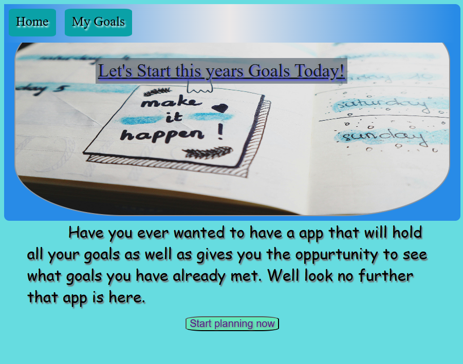

# 2025 Goal Tracker

The  2025 Goal tracker helps you keep up with this years goals. This app uses local storage to save the goals added to your computer so as you refresh the goals and info will be saved. You as a user have the ability to add new goals, update exsisting goals,delete goals and mark goals as completed.



view webpage live on github @  https://jennihunt.github.io/

## Table of Contents

- [Installation](#installation)
- [Usage](#usage)
- [Technologies](#technologies)
- [Pages](#pages)
- [Functionality](#functionality)
- [Contributing](#contributing)
- [Credits/Acknowledgements](#creditsacknowledgements)
- [License](#license)

## Installation

1. Clone the repository:
   ```sh
   git clone [https://github.com/jennihunt/jennihunt.github.io.git]
   ```
2. Navigate to the project directory:
   ```sh
   cd jennihunt.github.io
   ```
3. Install the dependencies:
   ```sh
    npm install
   ```

## Usage

1. Start the development server:
   ```sh
   npm start
   ```
2. Open [http://localhost:8080](http://localhost:8080) to view it in the browser.


## Technologies
- JavaScript
- CSS
- HTML
- localStorage


## Pages

### Home Page

The Home Page displays information on what to expect from this application. This page also offers a link to the goals page.

### Goals Page

The Goals page allows the user to add new goals to their saved goals. It also offers the users the ability to edit,delete and also mark thru completed tasks.


## Functionality

- Display visual links to the product pages on the Home Page.
- Click on a product image to view all products for that category on the Product Page.
- click view Details to view more info on the product and have the ability to add item to cart (not currently attached to cart).

## Contributing

Contributions are welcome! Please feel free to submit a pull request if you would like to add new features, fix bugs, or improve the project.

## Credits/Acknowledgements

I would like to extend my gratitude to the contributors, mentors, and the open-source community for their support and resources throughout the development of this project:

- **Open Source Community:** Thank you for the invaluable tools, libraries, and documentation that made this project possible.
- **Mentors and Peers:** Special thanks to those who provided feedback, ideas, and encouragement during the development process.
- **Content Creators and Educators:** Appreciation for the tutorials, blog posts, and videos that guided the implementation of various features.

## License

This project is licensed under the MIT License - see the [LICENSE](LICENSE) file for details.
